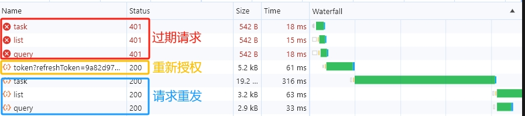

# rexios-js


## 安装

npm:

```bash
npm install rexios-js
```
yarn:
```bash
yarn add rexios-js
```
## 使用

>使用须知：此方案需要服务端生成双token，在主token过期失效的情况下，插件会自动拦截过期请求，调用用户自定义的重授权方法将备用token传递给服务端，以获取最新令牌；在重授权完成之后，插件自动重新原过期发起请求，返回正确数据之后，将数据传递给业务端处理。在此过程中，前端不会抛出任何异常。

```js
import useReXios from 'reXios-js'
let config = {
  needReplay: (error) => {
    const { status, config } = error.response
    if(status === 401) return true
    else return false
  },
  replayFunction: replayFunction
}

useReXios(config)
```
## useReXios的配置解析

useReXios的配置参数为四个函数作用分别如下：

1. needReplay函数作用是：判断在何种情况下应该发起重授权请求。返回一个布尔值，返回true代表当前情况需要重授权
2. replayFunction：重授权方法，需要手动实现一个通过备用token重新换取最新授权信息的函数。如：
```js
function replayFunction () {
  let refreshToken = sessionStorage.getItem('refreshToken')
  return axios.post(`/xxx/refresh_token?refreshToken=${refreshToken}`).then(res => {
    if (res.data.code != 200) {
      // refreshToken也已经失效了，用户很久没有登录了，这个时候可能需要跳转到登录页面（根据需求定义）
      return
    }
    sessionStorage.setItem('tokenInfo', res.data.token.access_token)
    sessionStorage.setItem('refreshToken', res.data.token.refreshToken)
  }).catch(err => {
    // 错误策略
  })
}
```
>注意： replayFunction应该返回promise，该promise resolve之后插件才会调用后续的请求重发过程。

效果如下：


## License

[MIT](LICENSE).
